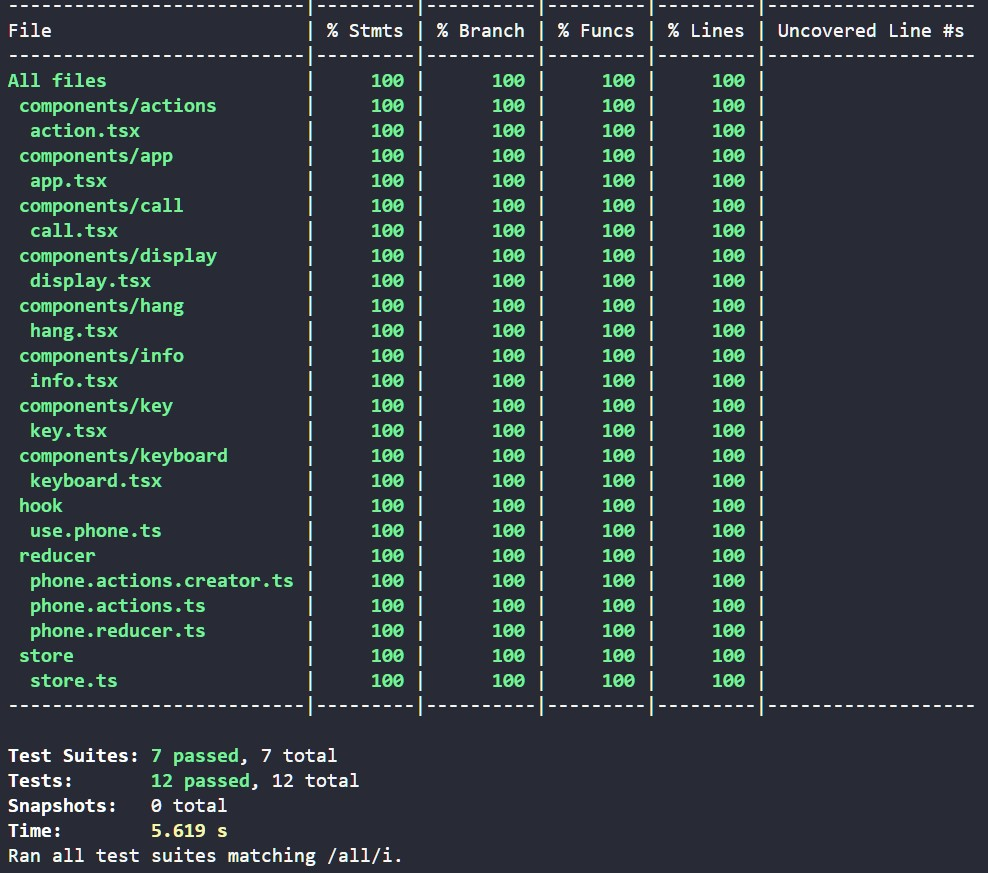

# Week 6 Challenge 3

## Creación de una aplicación web de teléfono con Redux

La aplicación debe mostrar un teléfono que cumpla con las siguientes características:

- Se debe poder escribir un número de teléfono clicando en los botones numéricos. La tecla borrar borra el número completo.
- Sólo se verá o el botón Llamar o el botón Colgar, nunca los dos a la vez.
- No se puede introducir un número de más de 9 cifras.
- El botón Llamar sólo se puede pulsar si el número tiene 9 cifras. Cuando tenga 9 cifras el botón debe tener la clase "active".
- El mensaje superior "Llamando..." sólo aparece cuando se pulsa el botón "Llamar" y mientras dure la llamada. Usa la clase "off" para controlar su visibilidad (el elemento HTML correspondiente debe seguir estando, aunque no se vea).
- Al pulsar el botón "Llamar", éste debe desaparecer del DOM y debe aparecer en su lugar el botón "Colgar". El teclado tiene que quedar deshabilitado.
- Al pulsar el botón "Colgar", éste debe desaparecer y debe aparecer en su lugar el botón "Llamar". El teclado tiene que habilitarse. Además, se debe borrar el número de teléfono.
- Si no ocurre nada tras cinco segundos de llamada, ésta se debe colgar automáticamente.
- Todo debe estar separado en los siguientes componentes:
      - Info
      - Display
      - Actions
        - Action
      - Keyboard
        - Key

## Jest Testing

## Listado de responsabilidades

- Info:
        - Recibe información del estado
        - Renderiza un texto en función del valor recibido
- Display:
        - Recibe del estado la información del número que se está marcando
        - Renderiza el número de forma dinámica conforme lo introduce el usuario

- Keyboard:
        - Renderiza las teclas y los botones de Llamar y Colgar
  - Key:
        - Recibe del estado el número y los métodos para actualizar la propiedad número al hacer click.
        - Renderiza los botones numéricos y de borrado. Comprueba el valor del número para desactivar los botones.

- Actions va a ser el contexto:
  - Renderiza los botones de llamar y colgar

- Call:
        - Renderiza el botón de llamar para un determinado valor del estado
        - Recibe del estado el valor de phone y actualización de isCalling
        - Interacciona onClick para actualizar el valor de isCalling y de number

- Hang:
        - Renderiza el botón de colgar para un determinado valor del estado
        - Recibe del estado el valor de isCalling
        - Interacciona onClick para actualizar el valor de isCalling
